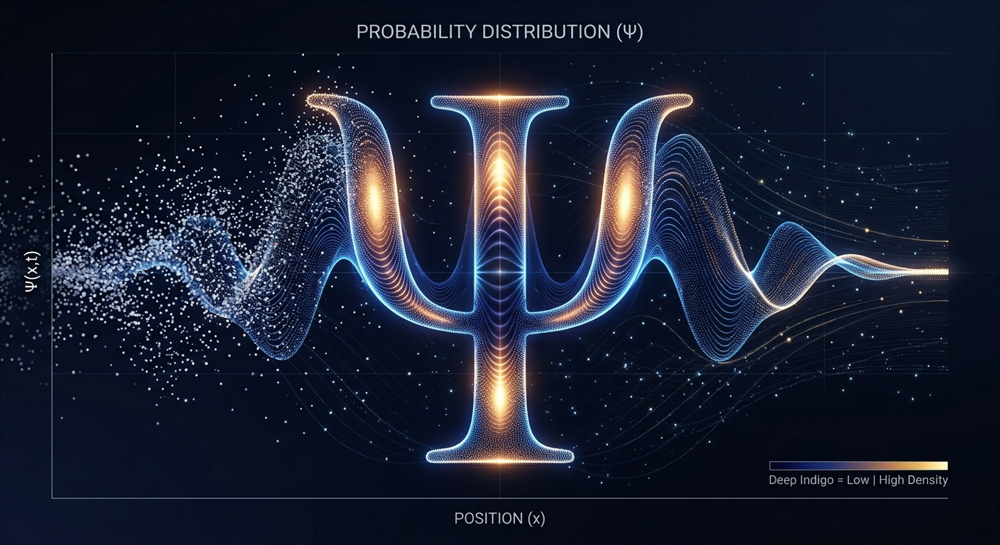
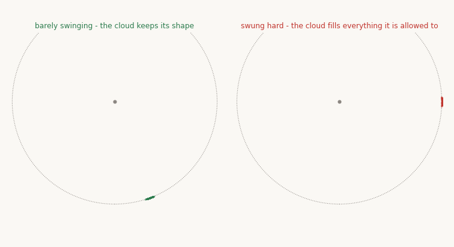
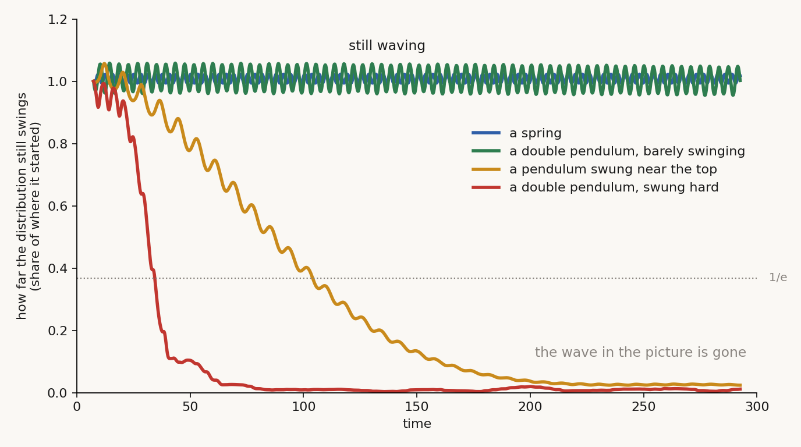
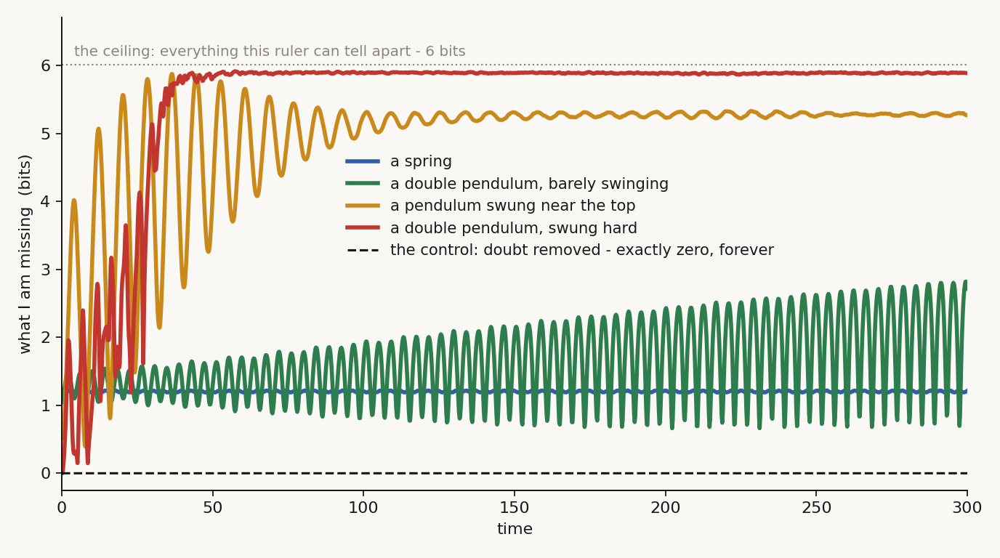
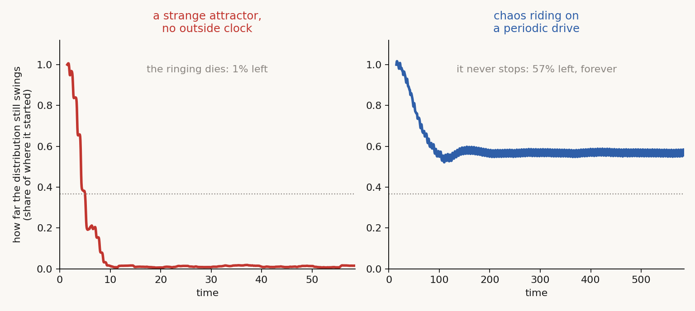
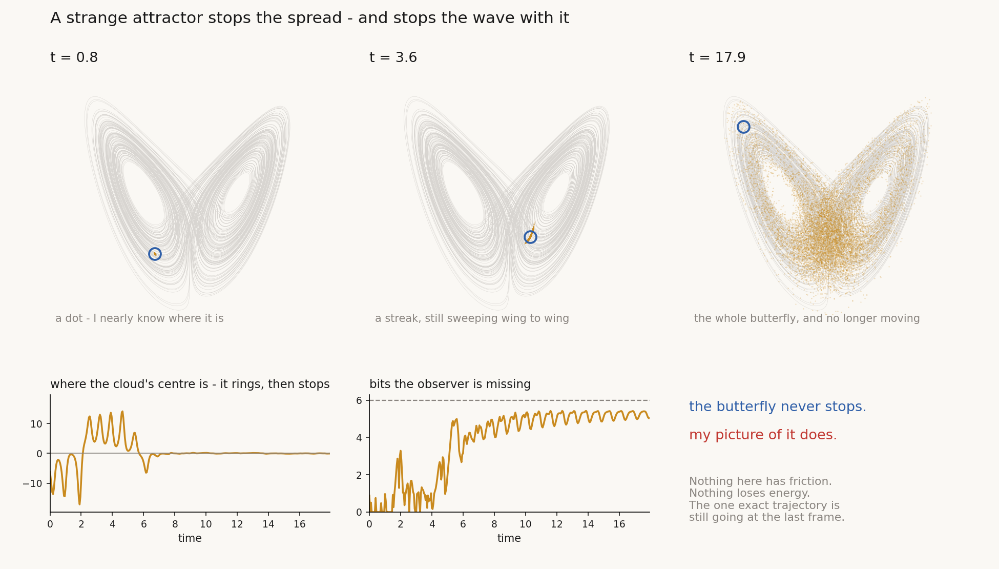

# Building a Wave

*Quest for Entropy #5: I wanted a probability cloud that spreads into a shape and then stops — and oscillates. I built six worlds to find one. Here is exactly how each of them failed.*

*What I was after: not a dot dissolving into noise, but a distribution that settles into a shape and keeps moving.*

## The question

Last time I ended on a cloud that dies.

Sixteen billiard balls. No friction, perfectly reversible mechanics. I didn't know the exact starting position — nobody ever does — so instead of one world I carried thousands, each slightly different. That spread of worlds is my probability cloud. It starts as a sharp dot. It ends as a flat grey wash across the table.

The balls keep bouncing forever. My picture of them keeps nothing.

Then I asked the question that started this quest, years before I knew how to ask it properly. And this time I am going to write down exactly what I am asking for, because "a probability wave" is too vague to test.

## What I want, precisely

Three things, in order. The cloud has to:

1. **Spread.** Start as a sharp dot and grow into something with width. Otherwise it never became a distribution at all.
2. **Stop spreading — partway.** Settle into a shape. A bell, a ring, a pair of lumps, I don't care which. The point is that it *stops*, and it stops **below** the flat grey. My missing information rises, then levels off, and stays there.
3. **Oscillate.** That shape then sloshes. Back and forth, and it keeps doing it.

Number 2 is the one I want to be loud about, because it's where the billiard balls fail and it took me a long time to say cleanly. The billiard cloud does step 1 beautifully. Then it just keeps going. It doesn't stop at a shape; it stops at *no shape*, spread evenly over everything the energy allows. Getting to maximum is not a wave. It's the absence of one.

A wave function doesn't do that. It has a shape and it holds it until something interrupts — a collision, a measurement, whatever you call the interruption. Between interruptions, nothing decays.

So: is there a deterministic machine whose cloud does 1, 2 and 3? Six worlds, one observer, one honest test.

## How I measure it

Everything here is one object: **a spread of belief, held by an observer who doesn't know everything.** Not a fluid, not a field, not a particle. Just my picture of where something is.

Two instruments, and I use the same two on every world.

**The swing.** How far the middle of the cloud still travels back and forth. That's requirement 3. If the swing dies, the cloud stopped sloshing.

**The bits I'm missing.** Lay a ruler over the table, ask which cell the thing is in, count how much of the answer I don't have. That's requirements 1 and 2 together: I watch the number rise, and I watch *where it stops*. It has a ceiling — 6 bits with the ruler I'm using — and the ceiling means the ruler has nothing left to tell me. Flat grey.

Two numbers. Six worlds. Same two numbers every time.

## The run

One observer with one fixed amount of doubt: **0.02 in every coordinate**, about a degree of angle — the sort of error a decent measurement leaves behind. I make **6,000 copies** of the world, each nudged by that much, and run all of them forward with exact reversible mechanics.

Before any of it counts, two controls.

**Is the computer lying?** Energy is conserved in these systems — nothing should ever gain or lose any. So if the energy drifts, the arithmetic is wrong and every result is suspect. Across the whole run the worst drift is **1 part in 10 million**.

**Is my code inventing the fog?** This is the one I care about. I run the same chaotic world again, but this time I tell the computer I know the starting position *exactly*. All 6,000 copies are then the identical world, so they should stay identical forever — a computer does the same arithmetic the same way every time, and identical inputs cannot drift apart. If they *do* drift apart, then something in my code is manufacturing differences that I never asked for, and every number below is an artefact of that.

They don't drift. The missing information stays at **exactly 0.000 bits**, every step, all the way to the end, and the copies remain identical to the last digit the machine can hold.

That is worth checking rather than assuming, because it is easy to leak randomness into a simulation without noticing. Having checked: every bit of fog below comes from the one thing I chose not to know at the start.

### The six worlds

Four with no friction at all:

- **A spring.** A weight bobbing. Special for one reason: every swing takes exactly the same time, no matter how big it is. No chaos anywhere in it.
- **A double pendulum, barely swinging.** Two arms, but a tiny amplitude. Almost the spring — except a double pendulum always has a little chaos hiding in it, even at small angles, and part of the point is to see whether that little bit costs anything.
- **A single pendulum, swung almost to the top.** Still not chaotic, still perfectly predictable in principle. But now a bigger swing takes *longer* than a small one, and that turns out to matter more than chaos does.
- **A double pendulum, swung hard.** The one from every chaos video. Full chaos.

And two with friction, which I'll get to further down: **Lorenz** — the butterfly — and **a driven pendulum**.

That's two of the four frictionless worlds, side by side. Both are clouds of pendulum tips — thousands of slightly-different worlds, each drawn as one dot.

**Left: the double pendulum barely swinging.** The cloud is a small tight streak, and it stays a small tight streak, sweeping around the rim like a thrown ball. It keeps its shape. This is what I was hoping to see, and it is real.

**Right: the same pendulum swung hard.** Within about a minute the dots have filled the whole region. And here is the thing worth being careful about: **that right-hand shape is not a pattern.** It looks like something — there's a rounded boundary — but that boundary is just the edge of where the energy allows the tip to go. Inside it, the dots are spread more or less evenly. It's the shape of the *container*, not a shape the cloud made. The cloud has no shape left at all.

## Does the swing survive?

Requirement 3 first, because it's the easy one.

Two lines stay flat at the top forever. Three hundred time units in, the spring is still swinging **1.02 times** as hard as it started — no decay at all; the small wobble is my measuring window, not the physics. The barely-swinging double pendulum: **1.00 times**.

Two lines fall off a cliff. The pendulum swung near the top drops to **2%** of its starting swing. The hard-swung one drops to **1%**, and gets there three times faster.

One number from the control here, and it's my favourite in this article. With the doubt switched off, the single exact double pendulum **never stops swinging.** Not at t=300, not ever. Nothing in these worlds has friction; nothing loses energy; nothing turns into heat. The pendulum swings as hard on the last step as the first.

So when the cloud's swing dies, **nothing physical has slowed down.** What died is my ability to say where in the swing the thing is. The wave that vanishes in these pictures was never in the world. It was only ever in my description of it.

That is the single most important sentence in this article. This is not a pendulum coming to rest. Nothing is coming to rest.

## Does the spread stop — and where?

Now requirement 2, the one I actually care about. Every world starts somewhere and climbs. The question is whether it levels off, and how high up it is when it does.

**The spring:** 1.20 bits at the start, 1.21 at the end. **20% of the ceiling**, and not climbing.

**Barely swinging:** 1.05 → 2.72 bits. **45% of the ceiling — and still climbing** when the run ends.

**Swung near the top:** 0.51 → 5.27 bits. **88% of the ceiling**, then flat.

**Swung hard:** 0.00 → 5.89 bits. **98% of the ceiling**, then flat.

Three of the four level off. That looks like a win until you see where.

**The two chaotic-ish worlds level off at 88% and 98%** — which is to say they level off at flat grey. They stop climbing because there's nothing left to climb. The hard-swung pendulum ends at 5.89 bits out of 6: I know essentially nothing about where the tip is, and that state is stable forever. It's a plateau, but it's the plateau at the top. Requirement 2 asked for a shape. This is the opposite of a shape.

**The spring never climbs at all.** It ends where it started. Over three hundred time units it rose **0.02 bits** — that's not a distribution settling into a shape, that's a distribution that never spread. It skipped requirement 1 entirely. The cloud is the same tight blob at the end as at the beginning, just moved.

**The barely-swinging pendulum is the only in-between case**, at 45% of the ceiling — and it is still going up when the run ends. That's the little bit of chaos in the double pendulum, doing exactly what you'd expect it to: leaking. Slowly, but with no sign of stopping. Give it long enough and I see no reason it wouldn't end up with the others.

So the honest verdict on my four frictionless worlds:

**Nothing rises to a shape and holds it.** The ones that hold a value, hold it at the top. The one that holds a low value, holds it by never having spread. The only world in between is still on its way up.

## Why — and the trap it sets

Put the two figures next to each other and the mechanism is right there. **The worlds whose clouds keep swinging are exactly the worlds whose clouds never spread.** The worlds that spread are exactly the ones that stop swinging. It's one axis, not two.

And the reason is almost embarrassingly simple: the swing survives while all the copies stay *in step*.

The spring keeps them in step because every copy takes the same time to swing, whatever error I made — a spread in *where* never turns into a spread in *when*. The pendulum near the top breaks step, because there a bigger swing takes longer, so copies that started slightly apart slowly drift out of phase until the cloud is smeared all the way round. Chaos does the same thing, only exponentially faster.

Which is the trap. Requirements 2 and 3 pull against each other. To keep swinging I need every copy to stay in step. But copies that stay in step forever never spread in the first place — so there's never a shape for the swinging to be a shape *of*.

That's the whole finding, in one line: **in these four worlds, the only thing that keeps the wave is the thing that stops a wave ever forming.** A tight blob being carried around a loop is not what I was asking for.

So the spreading has to be stopped by something other than never starting. Something has to come in from outside the copies themselves and put a limit on how far the cloud can go.

## What about attractors?

There's an obvious hole in all of that, and it was the first thing I got asked about. All four worlds are frictionless — and a frictionless world *cannot* have an attractor. That's Liouville: nothing is allowed to pull the cloud onto a smaller set. So I'd tested none of the systems people usually mean by "chaos". The butterfly. The weather.

Weather is exactly the right challenge: obviously chaotic, and yet summer still follows spring, every year, forever. Chaos that circles something and never stops — requirements 2 and 3 together, apparently for free.

So I ran two more worlds, with friction in them.

**Lorenz** — the butterfly. A strange attractor, with no clock anywhere outside it. Any rhythm has to be generated by the thing itself.

**A driven pendulum** — damped, chaotic, kicked by a perfect metronome. The weather case in miniature: messy dynamics riding on a clean annual cycle.

Here's the first thing, and it's a point for the weather intuition. **Both of them satisfy requirement 2.** Lorenz levels off at 5.51 bits, the driven pendulum at 5.20, and neither keeps climbing. An attractor really does stop the spread — the cloud settles onto the attractor's shape, and once it's there, it's there.

But look where those plateaus are: **92% and 86% of the ceiling.** They stop, but they stop at flat grey. The attractor limits the spread to "everywhere the attractor goes", and for these systems that's nearly everything.

Then requirement 3 splits them apart.

On the butterfly, the cloud **rings, and the ringing dies.** It sloshes between the two wings, falls to **1%** of where it started, and is done by about t=5. A strange attractor gives me the plateau and takes the wave.

That one is worth looking at rather than reading about, because it's the hardest idea in this article.

Three moments, over the faint outline of the butterfly. The blue ring is one exact trajectory. The amber is my cloud of copies.

At first they're the same thing: a dot. Then the cloud stretches into a streak, still sweeping wing to wing. By the end it has filled the whole butterfly — and **the blue ring is off in one wing on its own, still going.** It never slowed down. It never will. The traces underneath say it twice more: my cloud's centre rings and then flatlines, while the bits I'm missing climb and settle.

**The driven pendulum does the opposite, and this is the result I'd underline if I could only keep one.** Its swing drops for a while, then **settles at 57% and stays there** — flat to the end of the run, with no coherence time to measure, because it never dies.

The metronome saved the sloshing. Chaos on its own destroyed it in every world above; chaos with a clean beat underneath it keeps going forever. The weather intuition is exactly right, and right for the reason you'd guess: the seasons are not made by the weather, they're made by the Earth going round the Sun, and the weather rides on top without erasing them.

**So a driving belt does help — but only with one of the two things I asked for.** Look at where that same pendulum's entropy sits: **5.20 bits, 86% of the ceiling.** It sloshes forever, and what sloshes is a featureless fog. The beat rescued requirement 3 and did nothing at all for requirement 2. There is motion without a shape.

And the motion isn't even its own. I measured the rhythm of the surviving oscillation over the second half of the run: **period 9.420**. The metronome I plugged in runs at **9.425**. Those agree to five parts in ten thousand. The chaos didn't make a rhythm — it was handed one, and failed to destroy it.

## Where that leaves it

Six worlds, three requirements, and the results sort into three groups.

**Chaos on its own:** no shape, no sloshing. The two chaotic frictionless worlds end at 88% and 98% of the ceiling with their swing dead. This is the billiard-ball ending, again.

**Chaos with an attractor but no outside beat (Lorenz):** no shape, no sloshing. The attractor stops the spread — but at 92%, and the sloshing dies by t=5. An attractor on its own buys nothing I wanted.

**Chaos with a clean beat underneath (the driven pendulum): sloshing, but still no shape.** 57% of its swing, forever, at 86% of the ceiling. This is the one that gets halfway, and it's the only world of six that does.

Read down that list and the finding is not "chaos is useless". It's more specific and more useful than that:

> **A beat underneath chaos keeps the motion going. Nothing I tried gave the motion a shape.**

The fourth group — chaos, a beat, *and* a shape — is empty in this article. And the thing worth noticing is that the two worlds that never spread at all, the spring and the barely-swinging pendulum, don't fill it either: they keep a shape only by never letting the cloud become one. A tight blob carried around a loop is not a wave.

So the sharpened question isn't "does chaos work". It's:

**What has to be added to a beat and some chaos to make the fog condense into a shape — and hold it?**

I don't have the answer in this article. What I have is a specification precise enough that I'll know a real one when I see it, six measured ways of failing it, and — see the Confession — one obvious candidate I hadn't tried yet when I wrote this.

## The Confession

The concepts and the mechanics are textbook and I took them from the sources named below.

One gap I only saw afterwards: nothing here damps *and* makes its own rhythm — a limit cycle. It belonged in the line-up. I've started looking, and it doesn't behave like anything above, but I won't quote numbers I haven't checked as hard as these.

My three requirements are a low bar on purpose. A real wave function also adds, cancels, and gives the Born rule; the spring would fail all of that.

## What this does NOT claim

- Nothing here is a claim about how quantum mechanics works, and no Born rule is derived or attempted. This is what classical probability distributions can and cannot do.
- Six systems, one ruler, finite runs. The ordering held at every resolution I tried; the exact numbers are the ruler's.

## The neighbors

**Liouville** is why a frictionless system has no attractor — the cloud can stretch and fold, but nothing pulls it onto a smaller shape, which is why "it settled down" is never the explanation in the first four worlds. **Kolmogorov, Arnold and Moser** are behind the barely-swinging pendulum keeping its shape for so long: that regularity survives small disturbance is the KAM result, and it's why my second world isn't just a chaotic one in disguise. **Landau** gave phase mixing its name.

**Edward Lorenz** owns the butterfly. A distribution that rings and then dies on a strange attractor isn't a curiosity I found — it's what **Ruelle–Pollicott resonances** describe, and a complex one is exactly a density that oscillates while it decays. The permanent rhythm of a driven chaotic system has a name too: the **snapshot** or **pullback attractor** (Romeiras, Grebogi and Ott), which is how forced climate response is defined in climate science — so the seasons-versus-weather intuition is sound rather than a loose analogy.

## Run it yourself

Everything above is one lab: [github.com/masteris777/quest-for-entropy-building-a-wave](https://github.com/masteris777/quest-for-entropy-building-a-wave). One command, about ten minutes. It re-runs all six worlds from scratch and checks every number quoted in this article against the fresh output — the swings, the bits, where each one levels off, both controls, and the surviving rhythm. It exits non-zero if any of them has drifted. A second script redraws the figures.

If a number doesn't reproduce, tell me and I'll correct it in public.

## How this was made

I'm a software architect who does this as a hobby, not a physicist, and I say so every time. I set the questions, chose the worlds, and made the calls about what counts as an answer. The AI wrote the engine, the measurements and the figures, and argued with me about the definitions — the models are Fable 5, Opus 5 and Sonnet 5.

One thing worth admitting, the kind that goes in our honesty ledger rather than getting quietly fixed: my first double pendulum was wrong. I'd carried an old script forward with a sign error in it, and the giveaway was that its energy drifted no matter how small I made the time step. A real integration error shrinks when you shrink the step. This one didn't — so it wasn't integration, it was the equations. That's why the energy check is in the repo and quoted above. It's the control that caught me, before the article existed rather than after.

I also threw one measurement away. I'd wanted to show that chaos kills the wave *exponentially* while plain out-of-step drift manages only a slow power law. Nice story; the fits came back too close to call. So it isn't in the article — the fitting code is still in the repo if you want to see the thing that didn't work.

## Next time

If no machine of mine will build a wave, the obvious move is to look at something that already has one and ask what it has that I don't. Next time: a drum that rings forever and never forgets a thing, a droplet of oil that walks across a vibrating dish, and the one ingredient both of my failures were missing.

---

*Quest for Entropy is written by Marijus Masteika. Entropy was always the dark horse for me — connected to information, and maybe hiding answers to everything. That's the quest.*
